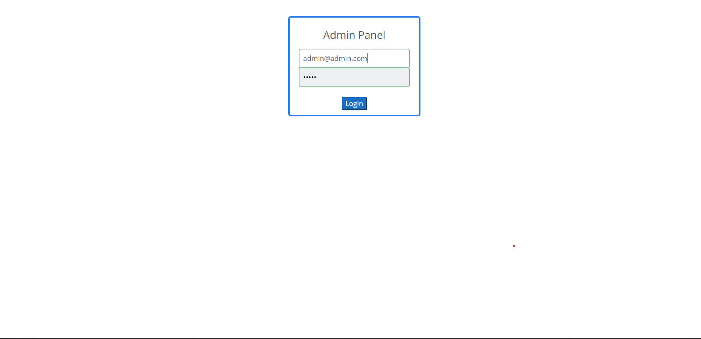
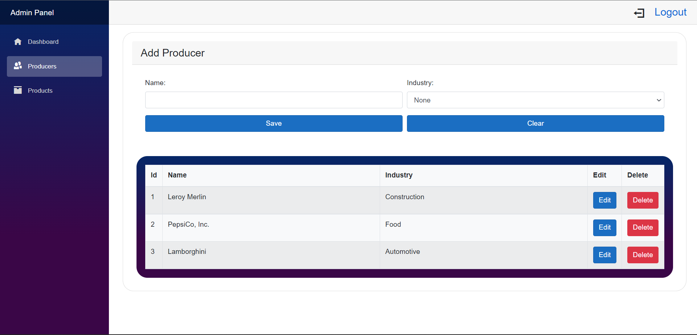
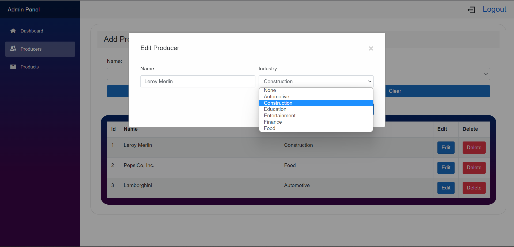
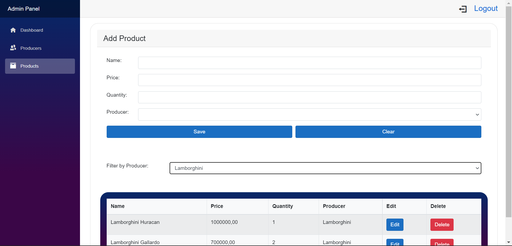
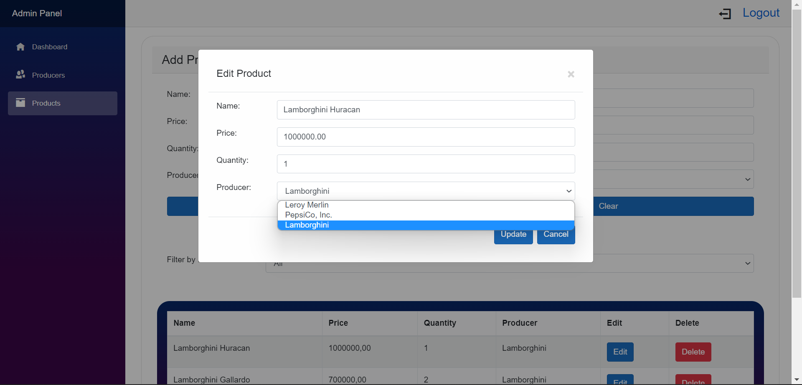
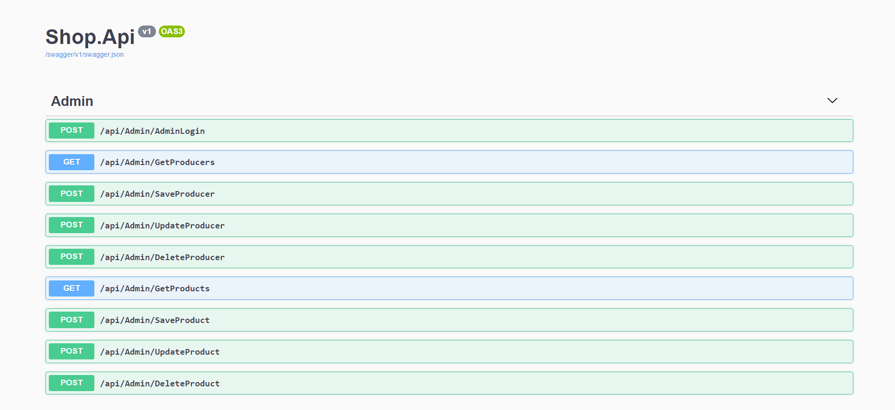

### shop-project

Store is too much to say. The assignment was to create somewhat of a product catalog. The code in this repository could only serve as a seed for a full-fledged store.
This would involve expanding the admin panel and adding a project responsible for user interaction.

Yet another CRUD in newly learned technology :')

---
Disclaimer:
Hence this is "just" a uni project, you might encounter truly painful code fragments like `catch(Exception){\\ignored};`. Sorry :)

### First run
Copy the contents of [appsettings.json.sample](https://github.com/mikolaj-skrzypczak/shop-project/blob/master/Shop.Api/appsettings.json.sample) in Shop.Api to `appsettings.json` and
replace Replace the `ConnectionString` with your own MySql database connection string.

Build & run Shop.Api and Shop.Admin, done!

Due to the `SeedDatabase` set to `true` in appsettings.json, the database will be seeded with some example data,
including administrator account with login `admin@admin.com` and password `admin`.

Visit:
* `https://localhost:44314/` to access the admin panel.
* `https://localhost:44377/swagger/` to access the swagger documentation.

### Screenshots:
Be aware that I am no frontend developer, so the UI is not beautiful, but I did my best to make it usable.

